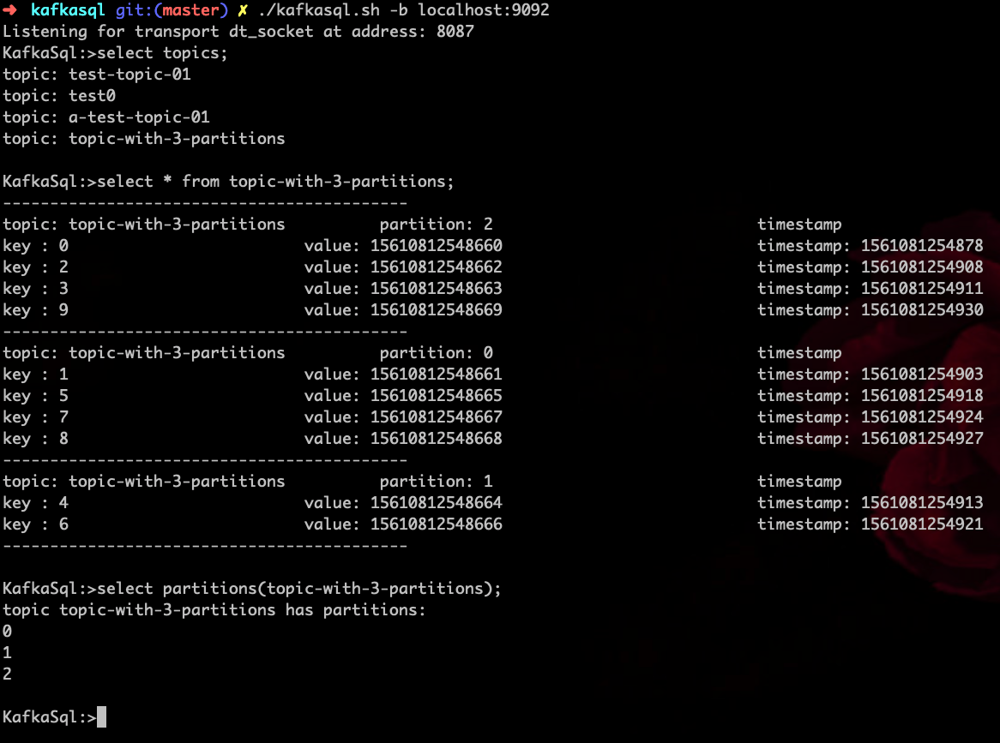
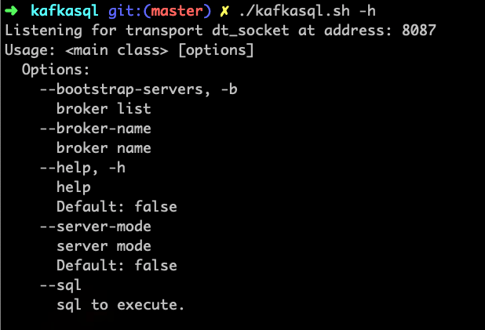

Read kafka messsage and other info via sql.

#Start

```bash
➜  kafkasql git:(master) ✗ ./kafkasql.sh -b localhost:9092
Listening for transport dt_socket at address: 8087
KafkaSql:>
```


#Usage

```bash
➜  kafkasql git:(master) ✗ ./kafkasql.sh -h
Listening for transport dt_socket at address: 8087
Usage: <main class> [options]
  Options:
    --bootstrap-servers, -b
      broker list
    --broker-name
      broker name
    --help, -h
      help
      Default: false
    --server-mode
      server mode
      Default: false
    --sql
      sql to execute.
```


#Syntax

```sql

select topics;

//message
select * from topic;
select * from topic where partition = 0;
select * from topic where partition in (0,1,2,3);
select * from topic where str(key) = 'aaa';
select * from topic where str(key) in('aaa', 'bbb', 'ccc');
select * from topic where timestamp = 1332232323155;
select * from topic where timestamp in (1332232323155, 133223232315212);
select * from topic where timestamp between(1332232323155, 133223232315212);


//message format
select byte(key), byte(value) from topic;
select str(key), str(value) from topic;

//offset
select offsets(topic);
select offsets(topic.1);

//partitions
select partitions(topic);

//consumers
select consumers(groupId);
select consumers(*);
select consumer_offset(topic);


```

#License
Apache License Version 2.0


#Examples

</p>
  
</p>


